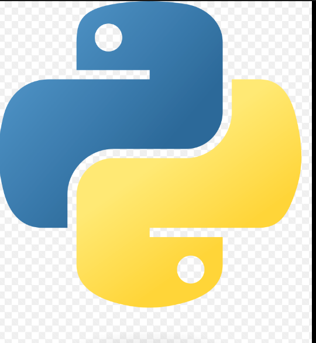

# **Projeto_c**
Projeto de estudos, git 
## Funções 
*chckout, home, catalogo*
##### melhorias
**melhoria 1 e 2**

### Linguagens do projeto

*HTML
*CSS
*PHP
*MySql

### A desenvolver :

1. Área de membros
    1. login diferente 
    2. desconto 
    3. css

2. Integração com outro
3. Sistema de bõnus primeira compra


#### imagem local 



#### imagem externa 


#### LINK:
[google](https://www.google.com.br/maps/preview)

## Código func soma

```javascript
function soma(a,b) {
    return a + b;
}
```

## LIsta tarefas  
- [x] membros
- [x] integração
- [] sistema de bonus
- [x] CSS do rodapé